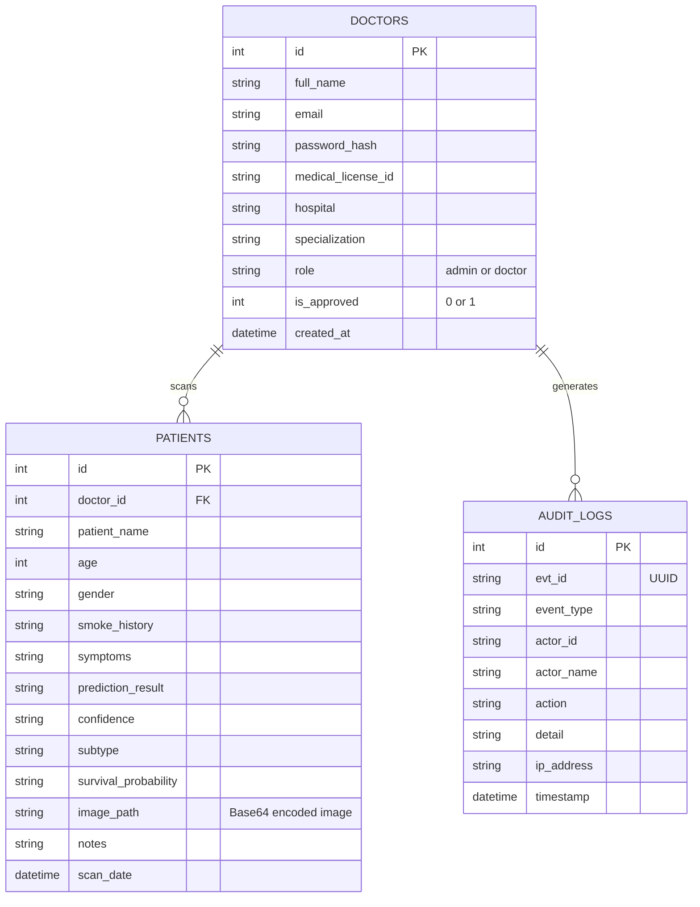

# 06. Database Schema Guide

CancerScan uses PostgreSQL hosted on Neon.tech. The database structure is defined in `backend/database/db.py`.

## 1. Entity Relationship Diagram (ERD)

## 2. Table Structures

### A. `doctors` Table
Stores all user accounts (both administrators and pathologists).

| Column | Type | Constraints | Description |
|--------|------|-------------|-------------|
| `id` | SERIAL | PRIMARY KEY | Unique ID |
| `full_name` | VARCHAR(255) | NOT NULL | Doctor's name |
| `email` | VARCHAR(255) | UNIQUE, NOT NULL | Login email |
| `password_hash` | VARCHAR(255) | NOT NULL | bcrypt hashed password |
| `medical_license_id` | VARCHAR(100) | | Medical registration number |
| `role` | VARCHAR(20) | DEFAULT 'doctor' | 'admin' or 'doctor' |
| `is_approved` | INTEGER | DEFAULT 0 | 0=Pending, 1=Approved |

### B. `patients` Table
Stores the actual scan records. 

| Column | Type | Constraints | Description |
|--------|------|-------------|-------------|
| `id` | SERIAL | PRIMARY KEY | Unique scan ID |
| `doctor_id` | INTEGER | FOREIGN KEY | References doctors(id) |
| `prediction_result`| VARCHAR(255) | | "Cancer Detected", "Benign", etc. |
| `confidence` | VARCHAR(50) | | ML probability (e.g. "0.98") |
| `subtype` | VARCHAR(100) | | "Adenocarcinoma", "SCC", etc. |
| `image_path` | TEXT | | **The slide image, encoded in Base64** |
| `notes` | TEXT | | Doctor's clinical notes |

> [!CAUTION]
> The `image_path` column does not store a file path. It stores the entire image converted into Base64 text (e.g., `data:image/jpeg;base64,/9j/4AAQ...`). This means each patient record is approximately 50-100 KB in size.

### C. `audit_logs` Table
A HIPAA-compliant log of all system actions. Every login, logout, registration, approval, and scan is recorded here. This table cannot be modified from the frontend application.

## 3. Database Initialization
When the backend starts, `db.py` calls `init_db()`.
This uses the SQL command `CREATE TABLE IF NOT EXISTS`. This means the tables are automatically created on Neon the very first time the app starts, without needing manual SQL scripts.
