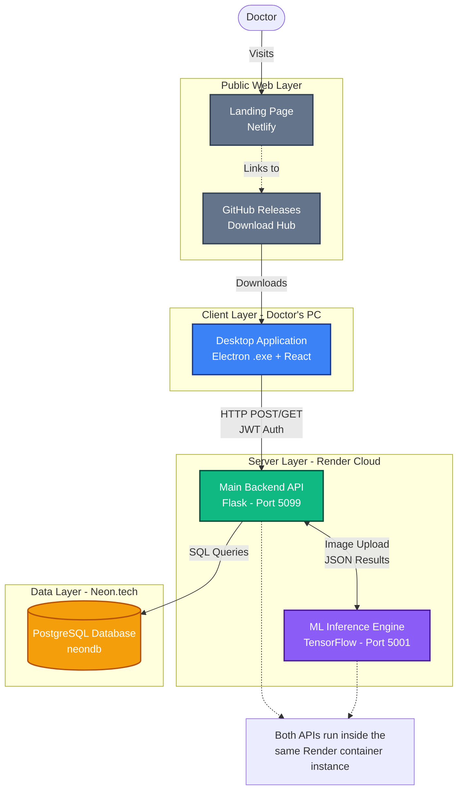

# 14. System Architecture Guide

This document maps the complete data flow of the CancerScan application, from the user's computer to the cloud infrastructure.

## Complete Deployment Architecture

## Data Flow: Processing a Scan

1. **User Interface:** The doctor opens the Electron app and navigates to the "Analysis" screen.
2. **Image Selection:** The doctor uploads a `.jpeg` or `.png` slide from their computer and fills in patient details (Age, Gender, Symptoms).
3. **Frontend API Call:** Axios sends a `multipart/form-data` POST request to `https://cancerscan.onrender.com/api/analysis/predict` including the doctor's JWT token.
4. **Backend Security Check:** The `@require_auth` middleware intercepts the request, verifies the JWT signature, and identifies the doctor.
5. **Backend Processing:** `analysis_routes.py` temporarily saves the image to the server's disk.
6. **ML Relay:** The backend forwards the image to the ML Engine at `http://localhost:5001/predict` (since they run in the same container, `localhost` is extremely fast).
7. **ML Validation:** The Gatekeeper checks if the image has H&E staining colors.
8. **ML Normalization:** Macenko normalizes the slide colors.
9. **ML Inference:** The TensorFlow `lcscnet_fold1.h5` model evaluates the image and returns probabilities for Normal, Adenocarcinoma, and SCC.
10. **Database Write:** The Main Backend receives the probabilities. It converts the slide image into Base64 text. It executes an `INSERT INTO patients` SQL query to Neon.
11. **Frontend Display:** The backend returns the final JSON to the Electron app, which displays the result and allows PDF download.
